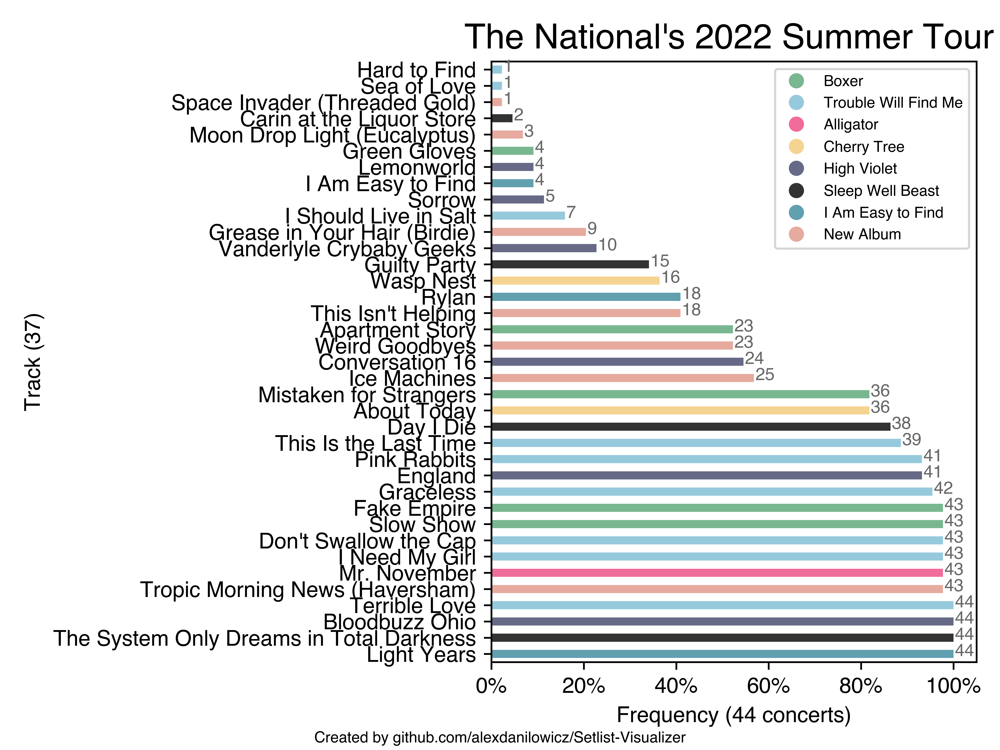

# 🎵 Setlist Visualizer



### Introduction

Python script that scrapes setlistfm for a given band and visualizes their setlists for a given tour.
.

_Setlist Visualizer is one of the first things I ever "programmed." There's cool functionality here that could be improved upon. I come back to it every few years after my favorite artists go on tour._

## Usage:

### 1. Install dependencies:

```
mkdir p3_env; python3 -m venv p3_env; source p3_env/bin/activate; pip3 install -r requirements.txt
```

### 2. Change constants:

At the top of the script, change the relevant constants.

### 3. Then, get the data in xlsx format

`python3 visualizeSongs.py`

### 4. Finally, visualize the data once you have it

`python3 visualizeSongs.py`

### Acknowledgements:

Author of original setlist.fm scraping: the talented **Ryan Lee Watts**

Github: https://github.com/ryanleewatts

Script: https://github.com/ryanleewatts/coding-project/blob/master/scraper/SetlistScript.py

## Sponsored by

Setlist Visualizer is proudly sponsored by [Magic Patterns](https://www.magicpatterns.com/), an AI design tool.
