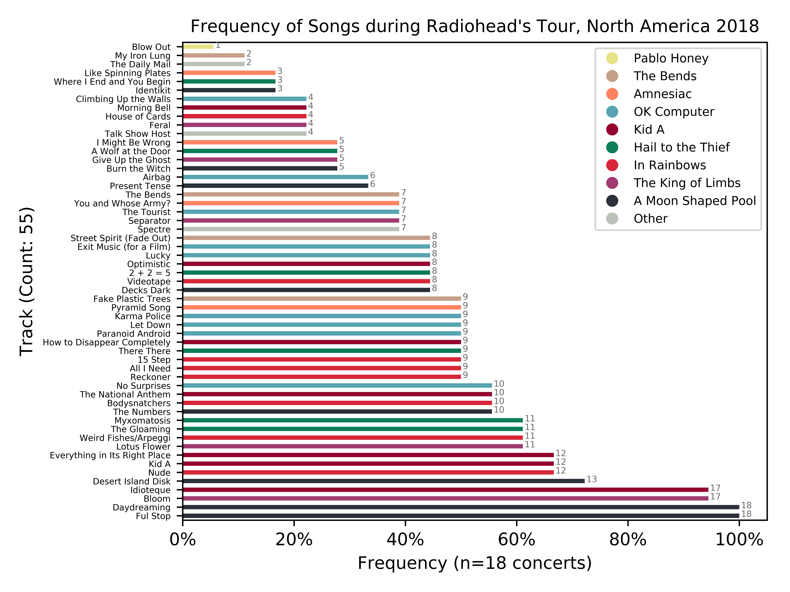

#  Setlist Visualizer

Python script which scrapes setlistfm website for data relating to any band you specify. Then, using pandas and matplotlib, it turns it the frequency of the songs they play into a pretty graph.

Could be applied to any band, tour/year, just need to change 3 constants at top of script.



### Run:

`python3 visualizeSongs.py`

### Choose your band:

Originally, used to scrape Radiohead data (because they are the greatest band of all time). Now, script can be used for any band.

At the top of the script, simply change:

1. ARTIST
	- this is used for titles

2. UNIQUE
	- the unique setlistfm string
	- Example: "interpol-2bd6982e.html", which is from: [https://www.setlist.fm/setlists/interpol-2bd6982e.html](https://www.setlist.fm/setlists/interpol-2bd6982e.html)

3. URL\_TO\_STOP_AT
 - the concert you want to stop at
 - Example: "interpol/2018/sexto-nplugged-sesto-al-reghena-italy"
 - *Note: make sure to get rid of HTTPS part*

### To install:

#### Dependencies
```
1. BeautifulSoup
2. requests
3. pandas
4. pathlib
5. matplotlib
```

### Acknowledgements:

Author of original setlist.fm scraping: the talented **Ryan Lee Watts**

Github: https://github.com/ryanleewatts

Script: https://github.com/ryanleewatts/coding-project/blob/master/scraper/SetlistScript.py
